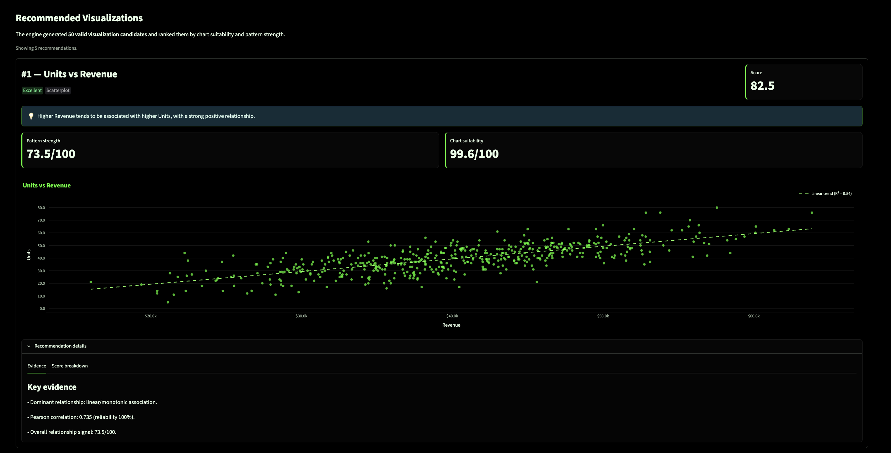

# Visift

**Visualization recommendations, ranked by insight.**

Visift is an explainable visualization recommendation engine that automatically profiles a CSV dataset, generates semantically valid chart candidates, scores how informative each visualization is likely to be, and ranks the strongest recommendations.

Instead of showing every chart that *can* be made, Visift prioritizes the charts most likely to reveal useful structure.

[Live Demo](https://visift-hq3sfksqtjznd4z8cuutv3.streamlit.app/) · [GitHub Repository](https://github.com/josh-hu1/Visift)

---

## Preview



---

## Why Visift?

Most visualization tools help users build charts after they already know what they want to inspect.

Visift addresses an earlier question:

> **Which visualizations are actually worth looking at first?**

Given a dataset, Visift:

1. profiles each column,
2. infers semantic data types,
3. generates valid visualization candidates,
4. measures chart-specific statistical patterns,
5. scores chart suitability and pattern strength,
6. globally ranks the candidates, and
7. removes redundant views while preserving useful alternatives.

The result is a short, explainable list of recommended visualizations rather than an exhaustive chart gallery.

---

## Features

- **Automatic semantic type inference** for numeric, categorical, ordinal, boolean, geographic, identifier, temporal, datetime, text, and empty fields
- **Five visualization families:** scatterplots, line charts, histograms, bar charts, and box plots
- **Chart-specific statistical scoring** instead of one generic heuristic
- **Global 0–100 recommendation scores** calibrated across visualization types
- **Pattern-aware explanations** describing why a chart was recommended
- **Alternative-view detection** to avoid ranking redundant charts separately
- **Missing-data and sample-size reliability adjustments**
- **Interactive Streamlit interface** with CSV upload, filtering, score breakdowns, and Plotly charts

---

## How It Works

```text
CSV / Dataset
    ↓
1. Data ingestion
    ↓
2. Dataset profiling
    ↓
3. Semantic type inference
    ↓
4. Visualization candidate generation
    ↓
5. Chart-specific pattern scoring
    ↓
6. Global ranking
    ↓
7. Recommendation diversification
    ↓
8. Plotly + Streamlit presentation
```

### 1. Profile

Visift examines:

- pandas data types
- missing values
- cardinality
- numeric distributions
- column names
- observed values

These signals are used to infer how each column should be interpreted.

### 2. Generate

Candidate generation is intentionally permissive. If a visualization is semantically reasonable, Visift creates it as a candidate.

Examples:

- numeric → histogram
- categorical → count bar chart
- numeric + numeric → scatterplot
- temporal + numeric → line chart
- categorical + numeric → mean bar chart and box plot

Generation answers:

> **Can this chart make sense?**

Scoring answers:

> **Is this chart likely to be useful?**

### 3. Score

Each candidate receives two high-level measurements:

- **Chart suitability** — semantic fit, readability, data quality, and sample support
- **Pattern strength** — chart-specific evidence that the visualization contains informative structure

A chart cannot receive a very high recommendation score solely because it is technically valid.

Conceptually:

```text
recommendation score
=
chart suitability
×
pattern-strength adjustment
```

### 4. Rank and Diversify

All supported visualization types compete on a shared 0–100 score.

Visift then groups recommendations using the same variables so that redundant charts do not dominate the final list. The highest-scoring chart becomes the primary recommendation, while other valid views are retained as alternatives.

---

## Chart-Specific Signals

### Scatterplots

Scatterplots evaluate both linear and nonlinear relationships using:

- Pearson correlation
- Spearman correlation
- p-value-based reliability calibration
- mutual information
- permutation-based nonlinear null calibration

This allows Visift to surface strong nonlinear relationships even when ordinary correlation is weak.

### Line Charts

Line charts can detect:

- monotonic trends
- seasonality
- persistent level shifts
- volatility shifts

The temporal scorer also accounts for sample size, missingness, temporal support, and statistical reliability.

### Histograms

Histograms evaluate:

- robust distribution asymmetry
- unusual tail observations
- multimodality

Multimodality is estimated using one- vs. two-component Gaussian mixture models with separation and component-balance checks.

### Bar Charts

Count bars measure meaningful category-frequency imbalance.

Mean bars measure how strongly group membership explains differences in a numeric variable.

### Box Plots

Box plots can be recommended because of:

- differences in group location
- differences in within-group dispersion
- differential outlier behavior

This makes box plots useful for more than simple mean or median comparisons.

---

## Recommendation Scale

| Score | Interpretation |
|---:|---|
| 80–100 | Excellent |
| 65–79 | Strong |
| 50–64 | Moderate |
| 35–49 | Weak |
| <35 | Very weak |

The thresholds and chart-family scoring scales were calibrated using dedicated synthetic evaluation suites.

---

## Evaluation

Visift includes several controlled synthetic benchmarks designed to test both ranking quality and false-positive behavior.

### Hardened benchmark

The final hardened benchmark contains:

- **125 datasets**
- **95 positive datasets**
- **30 null datasets**
- **1,850 visualization candidates**

Results:

| Metric | Result |
|---|---:|
| Top-1 retrieval accuracy | **100.0%** |
| Top-3 retrieval accuracy | **100.0%** |
| Top-5 retrieval accuracy | **100.0%** |
| Mean reciprocal rank | **1.000** |
| Median global rank | **1.0** |
| Null candidates scoring ≥50 | **0.0%** |
| Null candidates scoring ≥65 | **0.0%** |
| Highest observed null score | **46.65** |

On this controlled benchmark, every planted positive relationship was retrieved at global rank #1, while no evaluated null candidate reached the 50-point recommendation threshold.

### Cross-chart calibration

A separate benchmark tests whether the shared score remains comparable across visualization families when several planted patterns compete inside the same dataset.

The suite contains:

- **150 multi-pattern datasets**
- **6,300 visualization candidates**
- aligned-strength comparisons
- strong-vs-weak competitions
- extreme-vs-moderate competitions
- unrelated distractor candidates

After calibration, the median cross-family score spread was:

| Strength tier | Score spread |
|---|---:|
| Weak | **3.42** |
| Moderate | **7.55** |
| Strong | **5.54** |
| Extreme | **9.39** |

The intentionally stronger planted relationship was the best target in **100%** of mixed-strength comparisons across every focal chart family.

### Dedicated calibration suites

The repository also contains dedicated evaluation suites for:

- histogram scoring
- scatter scoring
- categorical / grouped scoring
- temporal scoring
- cross-chart score alignment
- null robustness
- sample-size reliability
- missingness robustness

Benchmark outputs are written under:

```text
evaluation/results/
```

---

## Project Structure

```text
Visift/
├── app.py
├── web_app.py
├── candidate_generator.py
├── profiler.py
├── semantic_types.py
├── synthetic_sales.csv
├── requirements.txt
│
├── scoring/
│   ├── engine.py
│   ├── bar.py
│   ├── scatter.py
│   ├── line.py
│   ├── histogram.py
│   └── box.py
│
├── visualization/
│   └── renderer.py
│
├── evaluation/
│   ├── benchmark.py
│   ├── histogram_calibration.py
│   ├── scatter_calibration.py
│   ├── categorical_calibration.py
│   ├── temporal_calibration.py
│   ├── cross_chart_calibration.py
│   └── results/
│
└── assets/
    └── app-preview.png
```

---

## Tech Stack

- **Python**
- **pandas**
- **NumPy**
- **SciPy**
- **scikit-learn**
- **Plotly**
- **Streamlit**

---

## Run Locally

Clone the repository:

```bash
git clone https://github.com/josh-hu1/Visift.git
cd Visift
```

Install dependencies:

```bash
pip install -r requirements.txt
```

Launch the Streamlit application:

```bash
streamlit run web_app.py
```

---

## Using Visift

1. Launch the application or open the live demo.
2. Choose the included sample dataset or upload a CSV.
3. Review the inferred semantic column types.
4. Open the **Recommendations** tab.
5. Inspect globally ranked visualizations and plain-English takeaways.
6. Expand **Recommendation details** for statistical evidence and score components.
7. Filter by chart type, minimum score, or number of recommendations.

---

## Design Principles

Visift was built around several principles:

- **Separate validity from usefulness.** A chart can be appropriate without being informative.
- **Use chart-specific evidence.** Different visualization types reveal different kinds of structure.
- **Account for reliability.** Small samples and missing data should reduce confidence.
- **Prefer effect size plus evidence.** Statistical significance alone should not determine usefulness.
- **Keep weak but valid candidates.** Low-information charts are ranked lower rather than silently removed.
- **Make rankings explainable.** Recommendation scores should be traceable to interpretable components.
- **Evaluate globally.** A score should remain meaningful when different visualization types compete.

---

## Current Limitations

Visift currently focuses on tabular CSV data and five visualization families.

Known limitations include:

- irregular temporal sampling can reduce FFT-based seasonality detection
- synthetic benchmarks do not replace evaluation on diverse real-world datasets
- semantic inference is heuristic and can misclassify ambiguous columns
- high-cardinality or domain-specific visualizations are outside the current scope

---

## Future Work

Potential extensions include:

- additional visualization families
- more robust seasonality detection for irregular time intervals
- real-world benchmark datasets
- user feedback signals for recommendation quality
- domain-aware semantic inference
- richer multivariate visualization recommendations

---

## Author

Built by **Josh Hu**, a Data Science student at the University of California, San Diego.
